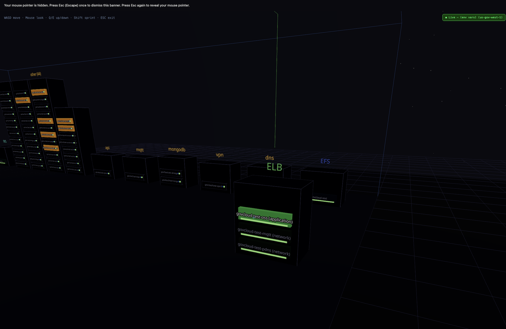
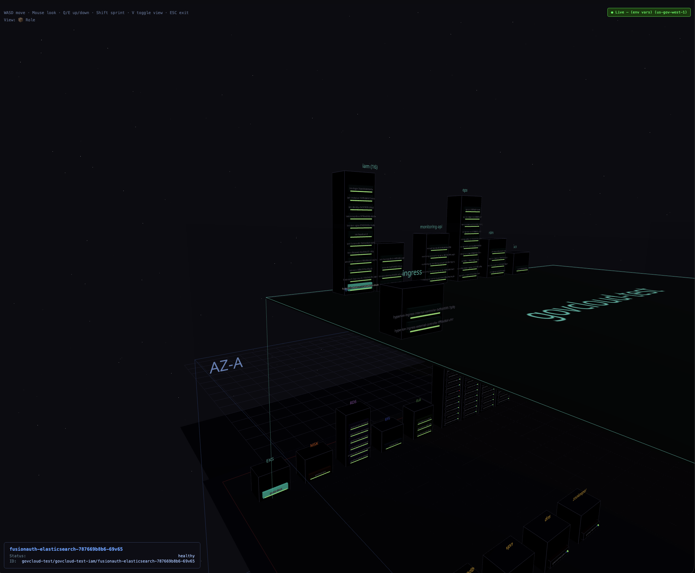

# aws3d

3D visualization of your AWS infrastructure. Walk through your cloud like a data center.





 

## What is this?

A browser-based 3D data center that renders your live AWS environment:

- **AZs** → Cages/rooms with wireframe walls
- **EC2 instances** → 1U servers in racks with blinking status LEDs
- **EKS clusters** → Click to expand into a floating "mezzanine" room showing namespaces as racks and pods as servers with live status LEDs
- **RDS databases** → Purple managed-service slabs with glow-strip health indicators
- **MSK brokers** → Orange slabs showing replication links across AZs
- **Multi-AZ connections** → Click any multi-AZ resource to see 90° routed interconnect lines
- **ELBs (ALB/NLB/CLB)** → Click to see color-coded listener port routing to target group instances
- **EFS** → Blue storage slabs with health indicators
- **VPCs** → Color-coded floor zones inside each AZ cage
- **Subnets** → Toggle network view (V key) to group racks by subnet

Navigate with WASD + mouse like a first-person game.

## Quickstart

```bash
git clone <this-repo>
cd aws3d
npm install
```

### 1. Start the local proxy

The proxy runs on your machine and uses your local AWS credentials. Nothing leaves localhost.

```bash
# Option A: Use environment variables (e.g., after assuming a role)
export AWS_ACCESS_KEY_ID=...
export AWS_SECRET_ACCESS_KEY=...
export AWS_SESSION_TOKEN=...
npm run serve -- --region us-east-1

# Option B: Use a named profile from ~/.aws/config
npm run serve -- --profile my-profile --region us-west-2

# Option C: Use whatever AWS_PROFILE is set
export AWS_PROFILE=production
npm run serve

# Option D: Auto-assume a role (auto-refreshes before expiry)
# Set base credentials first (IAM user or SSO), then pass the role ARN:
export AWS_ACCESS_KEY_ID=<base-key>
export AWS_SECRET_ACCESS_KEY=<base-secret>
npm run serve -- --role-arn arn:aws:iam::123456789012:role/ReadOnlyRole --region us-east-1
```

When using `--role-arn`, the proxy calls `sts:AssumeRole` using your base credentials
and automatically re-assumes the role ~5 minutes before the session expires. No manual
refresh needed — the proxy stays alive indefinitely.

**Important:** The base credentials (env vars or profile) must be able to *call*
`sts:AssumeRole` — they cannot already be the target role's session. If you use a
shell function that assumes a role and exports session tokens, pass only the
pre-assume base credentials to the proxy and let `--role-arn` handle the assume.
The UI's ↻ Refresh button also relies on this — it can only re-assume when
`--role-arn` is set with valid base credentials.

The proxy binds to `127.0.0.1:9876` — it only accepts connections from localhost.

### 2. Start the frontend

In a separate terminal:

```bash
npm run dev
```

Open http://localhost:5173. The UI auto-detects the proxy and shows a green **● Live** badge when connected.

If the proxy isn't running, the app shows sample data in demo mode.

## Controls

| Key | Action |
|-----|--------|
| Click canvas | Enter FPS mode |
| W/A/S/D | Move forward/left/back/right |
| Mouse | Look around |
| Q/E | Move down/up |
| Shift | Sprint |
| ESC | Release cursor |
| Click server | Pin selection, show interconnects |
| Click floor | Clear selection |
| V | Toggle view mode (Role ↔ Subnet) |
| Ctrl+R | Reboot pinned EC2 instance |
| Ctrl+S | Stop/Start pinned EC2 instance |
| Ctrl+G | Show security group inbound rules |
| Ctrl+N | Show NACL rules for subnet |
| Ctrl+K | Kill (delete) pinned pod |
| N | Toggle EKS node view (when mezzanine open) |

## Features

### EC2 Instances
- Orange 1U server boxes with blinking status LEDs (green=running, amber=degraded, dim red=stopped)
- Hover to see name, click to pin
- Info panel shows: type, IP, status checks (2/2), uptime, volumes (size/type), subnet, VPC
- Last 5 CloudTrail events (reboot, stop, start, etc.)
- Actions: Ctrl+R reboot, Ctrl+S stop/start
- Security groups (Ctrl+G) and NACLs (Ctrl+N) on demand

### EKS Clusters
- Click cluster in rack → floating mezzanine room appears above AZ
- Namespace racks with pod servers inside
- Pod status LEDs reflect real K8s pod phase (Running/Pending/Failed)
- Pod info: node (EC2 ID), containers, ready count, restarts, uptime
- Ctrl+K to kill a pod (triggers recreation by deployment controller)
- Vertical connector line from rack to mezzanine
- Cluster name prefix stripped from namespace/pod labels for readability

### ELBs (ALB/NLB/CLB)
- Click an ELB → color-coded floating labels show each listener rule
- Path-based routing visible: `:443 /api/* → api-tg (:8080)`
- Target instances highlight in the matching listener color
- DNS name shown in info panel

### RDS Databases
- Purple managed-service slabs with glow-strip health
- Multi-AZ: standby instance appears in opposite AZ
- Click primary → interconnect line to standby
- Endpoint DNS shown in info panel

### MSK (Kafka)
- Orange slabs showing broker status
- Click → interconnect lines between AZ brokers

### Network Visualization
- VPC floor zones (colored rectangles) inside each AZ cage
- Press V to toggle subnet view (racks grouped by subnet instead of role)
- Subnet CIDR labels on rack headers in network mode

### Credential Management
- Auto-detects expired credentials
- `--role-arn` flag enables automatic re-assumption before expiry
- Proactive refresh timer (checks every 60s, refreshes 5min before expiry)
- Status badge: `● Live`, `◌ Loading...`, `○ Sample Data`, `⚠ Credentials Expired`

## Architecture

```
Browser (localhost:5173)          Local Proxy (127.0.0.1:9876)
┌─────────────────────┐          ┌──────────────────────────┐
│  React + R3F        │  fetch   │  Node.js + AWS SDK v3    │
│  3D Scene           │ ───────► │  Uses YOUR credentials   │
│  No credentials     │          │  Calls AWS APIs directly │
└─────────────────────┘          └──────────┬───────────────┘
                                            │
                                            ▼
                                   AWS APIs (EC2, EKS, RDS, MSK,
                                   ELB, EFS, CloudTrail, STS)
```

**Security model:**
- Credentials never leave your machine
- Proxy binds to `127.0.0.1` only
- CORS restricted to localhost origins
- No backend server, no data exfiltration
- Frontend is a static SPA — can be served from a CDN

## Project Structure

```
src/
├── data/
│   ├── infrastructure.js   ← Sample/fallback data model
│   └── fetchStatus.js      ← Auto-detects proxy, polls for live data
├── components/
│   ├── DataCenter.jsx      ← Scene layout (cages, racks, interconnects)
│   ├── Cage.jsx            ← AZ enclosure
│   ├── Rack.jsx            ← Server cabinet (splits at 12 units, max 10 wide)
│   ├── ServerBox.jsx       ← EC2 instance (orange chassis, blinking LEDs)
│   ├── ManagedServiceBox.jsx ← Managed service (colored slab, glow strip)
│   ├── EksMezzanine.jsx    ← Floating EKS cluster room (namespaces + pods)
│   ├── Interconnect.jsx    ← 90° routed cross-AZ connection lines
│   ├── WASDControls.jsx    ← FPS camera movement
│   └── HUD.jsx             ← 2D overlay (connection status, server info)
├── App.jsx
└── main.jsx
server/
└── proxy.js                ← Local AWS API proxy
bin/
└── aws3d.js                ← CLI entry point
```

## AWS Permissions Required

The proxy calls these APIs (read-only):

- `ec2:DescribeInstances`
- `ec2:DescribeInstanceStatus`
- `ec2:DescribeVolumes`
- `ec2:DescribeSubnets`
- `ec2:DescribeSecurityGroups`
- `ec2:DescribeNetworkAcls`
- `eks:ListClusters`
- `eks:DescribeCluster`
- `rds:DescribeDBInstances`
- `kafka:ListClustersV2`
- `elasticloadbalancing:DescribeLoadBalancers`
- `elasticloadbalancing:DescribeTargetGroups`
- `elasticloadbalancing:DescribeTargetHealth`
- `elasticloadbalancing:DescribeListeners`
- `elasticloadbalancing:DescribeRules`
- `elasticfilesystem:DescribeFileSystems`
- `cloudtrail:LookupEvents`

For EC2 actions (optional):
- `ec2:RebootInstances`
- `ec2:StopInstances`
- `ec2:StartInstances`

### EKS Kubernetes Visualization

To see namespace/pod details when clicking an EKS cluster, your IAM role also needs:
- Kubernetes RBAC access to the cluster (list namespaces, list pods)
- This is typically granted via `aws-auth` ConfigMap or EKS access entries
- The proxy generates an EKS auth token using the same IAM role it uses for AWS APIs

## Shared / Read-Only Server

Deploy for team-wide read-only access:

```bash
npm run serve -- --host 0.0.0.0 --read-only --role-arn arn:aws:iam::123456789:role/ReadRole --region us-east-1
```

Flags:
- `--host 0.0.0.0` — Bind to all interfaces (LAN-accessible)
- `--read-only` — Disables mutating actions (reboot, stop, start, kill pod) at server level; hides action UI
- `--role-arn` — Required for auto-refresh to work (proxy re-assumes before expiry)

**Important:** Base credentials (env vars or profile) must be able to call `sts:AssumeRole` —
they cannot already be the assumed role's session tokens. The UI refresh button only works
when `--role-arn` is set with valid base credentials.

## Docker / Kubernetes Deployment

A `Dockerfile` is provided for containerized deployments. Builds frontend with configurable
`BASE_PATH` and bundles nginx + node backend in a single image.

```bash
docker build --platform linux/amd64 --build-arg BASE_PATH=/aws3d/ -t your-registry/aws3d:latest .
docker push your-registry/aws3d:latest
```

Kubernetes manifests in `deploy/`:
- `k8s.yaml` — Deployment + Service (edit image, namespace, role ARN, registry secret)
- `nginx.conf` — Internal nginx (serves static files + proxies /api to node backend on :9876)
- `entrypoint.sh` — Starts both node proxy and nginx

Container env vars:
- `AWS_REGION` — Target region
- `ROLE_ARN` — IAM role to assume (enables auto-refresh)
- `AWS_ACCESS_KEY_ID` / `AWS_SECRET_ACCESS_KEY` — Base credentials that can assume the role

To route through an existing reverse proxy, add:
```nginx
location /aws3d/ {
    proxy_pass http://aws3d-service:8080/;
}
```

## EKS Node View

Press **N** (when mezzanine is open) to toggle between namespace view and node view:
- **Namespace view** (default) — Racks grouped by namespace
- **Node view** — Racks grouped by EC2 node, pods color-coded by namespace
  - Resource utilization (CPU/Mem %) shown at top of each rack
  - Color legend on the right maps namespaces to colors
  - Falls back to pod resource requests if metrics-server is unavailable

## Development Notes

- Frontend uses React Three Fiber (R3F) + drei for 3D rendering
- Proxy URL is auto-detected: uses `import.meta.env.BASE_URL` to determine if deployed
  behind a subpath (same-origin API) or running locally (port 9876)
- Pod health: `Running` + `ready === total` + `restarts < 5` = healthy; otherwise degraded
- EKS mezzanine polls every 15 seconds for pod/node updates
- Main infrastructure polls every 15 seconds
- `window.__aws3dFastPoll` triggers 10 rapid polls at 3s intervals (used after EC2 actions)

### Key Implementation Details

| Concern | Implementation |
|---------|---------------|
| PROXY_URL detection | `import.meta.env.BASE_URL` — `/` means local dev (`:9876`), otherwise same-origin subpath |
| EKS auth tokens | Presigned STS GetCallerIdentity URL, base64url encoded as `k8s-aws-v1.<token>` |
| Read-only enforcement | Server returns 403 on mutating endpoints; frontend hides controls based on `/api/health` `readOnly` field |
| Credential refresh | Only works with `--role-arn`; env-var-only mode cannot self-refresh |
| Platform builds | Docker images must be `--platform linux/amd64` for typical k8s clusters |

## Global Install (optional)

```bash
npm link
aws3d serve --profile my-profile --region us-east-1
```

## License

MIT
